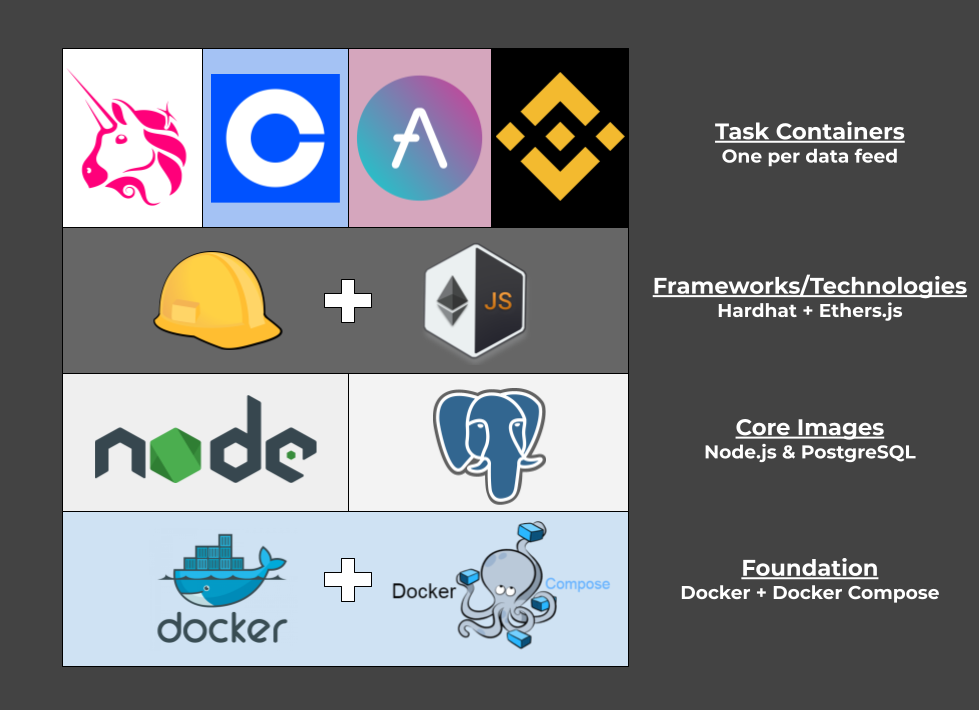

# Crypto ETL
Crypto data ETL framework for streaming and storing data from on and off-chain sources using Hardhat, Ethers.js & PostgreSQL. Includes an implementation for Uniswap V2 data streaming.

## Quickstart
Ensure you have the latest versions of `docker` & `docker-compose` on your machine. Clone the project:

`git clone https://github.com/jakemath/Crypto-ETL`

Move into the project directory and run the containers:

`cd UniswapETL && bash run.sh`

This will immediately build and run the relevant task containers defined in `docker-compose.yml` using `docker-compose`.

Once the build completes, you will be streaming near real-time data from Uniswap! 

## Architecture

This framework is designed to concurrently stream several data feeds, even on the same host. 

Each distinct data feed can be deployed in its own docker container with unique environment configurations. 

