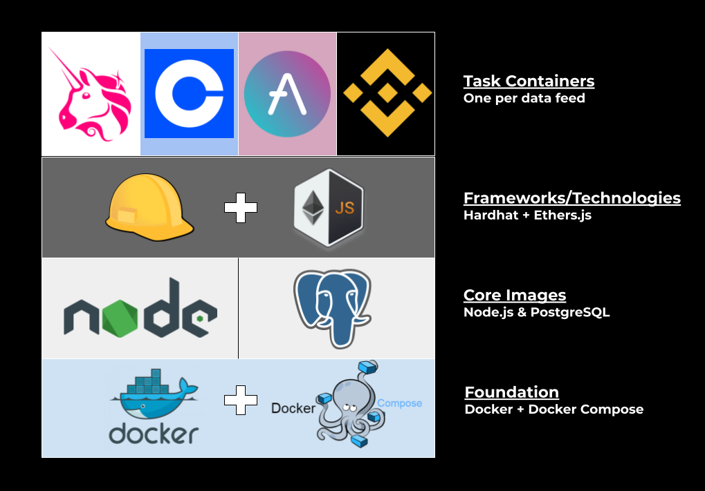

# BlockOps
Blockchain operations framework capable of streaming and storing data from on and off-chain sources using Node.js, Hardhat & Ethers.js. Includes sample on and off-chain data streaming implementations for Uniswap V2.

## Available Tasks
```
1. track-tokens (off-chain)
    - Polls Uniswap V2 subgraph for updates to target token's Token entity
    - Writes entity updates to DB as TokenObservations
    - Calculates 24-hour liquidity and volume from TokenObservations
2. track-pairs (on-chain) 
    - Streams events emitted from all Pair contracts for target tokens
3. archiver (on-chain)
    - Listens for new contract deployments block-by-block and attempts to decode contract bytecode
```

## Setup
Clone the project
```bash
cd ~/
git clone https://github.com/jakemath/blockops
```

### Quickstart - Containerized
Ensure you have the latest versions of `docker` & `docker-compose` on your machine. 

Move into the project directory and run the containers
```bash
cd ~/blockops
./run.sh archiver
```

This will build and run the relevant task containers defined in `docker-compose.yml` using `docker-compose`.

#### Stream Logs
In the containerized deployment, logs from all containers will automatically be streamed to the console. You can manually stream the logs via
```bash
./stream_logs.sh archiver
```

#### Terminate All Tasks
Stop and remove all containers
```bash
./stop.sh archiver
```

#### Clear Cache
Wipe all Docker images, container data, and volumes (WARNING: clears all database data as well)
```bash
./cleanup.sh archiver
```

### Quickstart - Local
You can also run a task directly on your machine to observe and debug a task. You will need `node.js >= 16.8` and `npm` installed on your machine.

Download the project packages:
```bash
cd ~/blockops/src
npm install
```
Export the TASK variable as the name of the task you want to run (`track-tokens` in this example) and run `dispatch.js` - this is the main entrypoint script automatically executed in the containerized deployment:
```bash
cd ~/blockops
export TASK=archiver
node dispatch.js
```

Both of these execution methods will stream Uniswap data in real-time!

## Architecture

This project is a single-host framework capable of processing multiple data feeds and jobs concurrently. Data feeds and processes are referred to as `tasks`, and are specified with the `TASK` environment variable. Each container sets this variable, which maps to configurations specified in `src/conf/tasks.json`. 

### Task Configuration - `src/conf/tasks.json`
```json
{
    "task-name": {
        "module": "path/to/task/module",
        "function": "functionName",
        "args": [],
        "onChain": "true or false",
    }
}
```
This configuration can be customized to one's needs - the same task function can be called via multiple tasks with either the same or different function arguments.

The `onChain` key specifies whether the task should be run using the Hardhat Runtime Environment. This enables lower-level blockchain interactions leveraging Hardhat and Ethers.js. These tasks should be defined as hardhat tasks and imported into `hardhat.config.js`. See `src/tasks/uniswapOnChain.js` for an example.

### Docker Image
Task containers are built with a `node.js` base image - the `package.json` file further specifies Hardhat and Ethers.js as dependencies. These libraries enable one to interact with blockchain networks at low levels - see `src/tasks/uniswapOnChain.js` for an example.

### Docker Compose
Each distinct task should be added as a distinct service in `docker-compose.yml`. Unless otherwise specified, all task containers share the same `node_modules` folder as a mounted volume. This means project dependencies only need to be downloaded once in deployment, regardless of the number of tasks.

### Single-Host Architecture


By supporting many different data feeds on the same machine, the single-host architecture effectively maximizes server resources. A true production-grade data platform, however, may seek to decouple the various components into a distributed system, like the diagram below illustrates.

### Distributed Architecture


In the distributed architecture, all individual components are decoupled into their own services across various nodes. Additionally, a message queue cluster is used to coordinate tasks and processes. Message queue architectures are especially powerful for data platforms due to their scalability and flexibility. Among the many benefits, a message queue easily enables horizontal scalability, asynchronous execution of tasks, custom task routing, and, in the case of task failure, automatic retries with exponential backoff.

#### Components
##### Data Feed Nodes
Each data feed is run on its own node as a standalone container - `docker-compose` on the node itself is not required in this case. These nodes serve as the task producers. Instead of sending data directly to storage, these nodes serve as task producers for the message queue cluster.

##### Message Queue Cluster
The message queue cluster (BullMQ + Redis) sits between the data feed nodes and the rest of the architecture. Instead of writing the datapoints directly to storage, the data nodes submit messages indicating the task to execute and the data to process to the cluster to offload the work. The queue then broadcasts the messages for any available worker nodes to process.


##### Worker Cluster
The worker node cluster sits between the message queue cluster and the data storage facility. These nodes serve as consumers of the messages broadcasted by the message queue cluster, which were produced by the data feed nodes. These nodes, in tandem with the message queue cluster, can effectively focus resources on ensuring data and processes run to completion.

##### Storage
Finally, the RDBMS system (PostgreSQL) in the single-host architecture is replaced with a hosted data warehouse service, such as Google BigQuery. This type of storage lends itself to better scalability for big data. 
