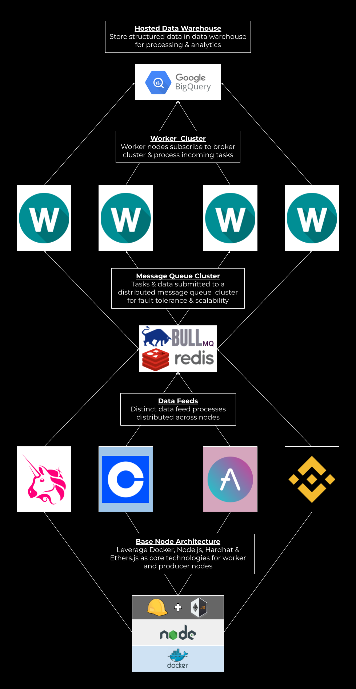

# Crypto ETL
Crypto data ETL framework for streaming and storing data from on and off-chain sources using Hardhat, Ethers.js & PostgreSQL. Includes an implementation for streaming Uniswap V2 data from both the subgraph and pair contracts.

## Setup
Ensure you have the latest versions of `docker` & `docker-compose` on your machine. Clone the project:

```bash
cd ~/
git clone https://github.com/jakemath/Crypto-ETL
```

### Quickstart - Prod Mode
Move into the project directory and run the containers:

```bash
cd ~/Crypto-ETL
bash run.sh
```

This will build and run the relevant task containers defined in `docker-compose.yml` using `docker-compose`.

Once the build completes, you'll be streaming real-time data from Uniswap! 

### Quickstart - Local
You can also run a task directly on your machine to observe and debug a task - note that the database cannot be utilized in this mode. You will need `node.js >= 16.8` and `npm` installed on your machine.

Ensure the `PROD` variable is unset:
```bash
unset PROD
```

Download the project packages:
```bash
cd ~/Crypto-ETL/src
npm install
```

Export the TASK variable as the name of the task you want to run (`uniswap-graph` in this example) and run `dispatch.js` - this is the main entrypoint script automatically executed in prod mode by `docker-compose`:
```bash
cd ~/Crypto-ETL
export TASK=uniswap-graph
node dispatch.js
```

## Architecture

This framework is designed to concurrently stream many data feeds on the same host. In production mode, each distinct data feed is deployed in its own docker container with the `TASK` environment variable set to the name of the respective task. The task name maps to configurations specified in `src/conf.json`, which can be customized to one's needs.

The base image for the tasks containers is `node.js`, and the `package.json` further specifies `hardhat` and `ethers.js` as dependencies. These enable one to interact with blockchain networks at a low levels if necessary - the `uniswap-ethers` task is an example of such a use case, in which events are directly streamed from pair contracts.

The locally-run architecture leveraging `docker-compose` is illustrated by the below diagram.

### Local Architecture


This architecture can support many different data feeds on the same machine, effectively maximizing server resources. A production-grade data platform may seek to decouple these components into a distributed system, like the below diagram illustrates.

### Distributed Architecture



In this architecture, all the individual components of the pipeline are decoupled into their own services. Additionally, the architecture integrates a message bus (RabbitMQ in this example) into the pipeline. It is built to scale.

Message bus architectures are especially powerful for data platforms due to their programmability and flexibility. Among other things, a message bus allows asynchronous execution of tasks such as writing data to a database, as well as automatic retries with exponential backoff in the case of failed tasks for any reason.
